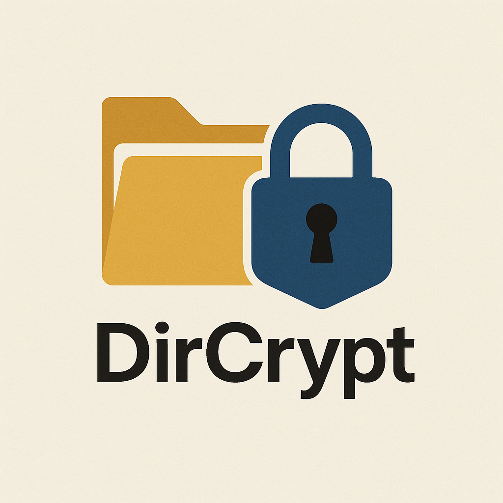

<!-- Improved compatibility of back to top link: See: https://github.com/othneildrew/Best-README-Template/pull/73 -->
<a id="readme-top"></a>
<!--
*** Thanks for checking out the Best-README-Template. If you have a suggestion
*** that would make this better, please fork the repo and create a pull request
*** or simply open an issue with the tag "enhancement".
*** Don't forget to give the project a star!
*** Thanks again! Now go create something AMAZING! :D
-->


<!-- PROJECT SHIELDS -->
<!--
*** I'm using markdown "reference style" links for readability.
*** Reference links are enclosed in brackets [ ] instead of parentheses ( ).
*** See the bottom of this document for the declaration of the reference variables
*** for contributors-url, forks-url, etc. This is an optional, concise syntax you may use.
*** https://www.markdownguide.org/basic-syntax/#reference-style-links
-->
[![Contributors][contributors-shield]][contributors-url]
[![Forks][forks-shield]][forks-url]
[![Stargazers][stars-shield]][stars-url]
[![Issues][issues-shield]][issues-url]
[![project_license][license-shield]][license-url]
[![LinkedIn][linkedin-shield]][linkedin-url]


<!-- PROJECT LOGO -->
<br />
<div align="center">
  <a href="https://github.com/msitni1337/DirCrypt">
    
  </a>

<h3 align="center">DirCrypt</h3>

  <p align="center">
    DirCrypt is a lightweight and secure Windows application designed to encrypt another application's whole folder and "securly" decrypt it and running it. With a simple interface but strong encryption, the application files are by themselves stored encrypted but decrypted in runtime using the decryption key, you can also set a number of times you want the user to decrypt/run your application — perfect when you want to give a demo try for your beloved application.
    <br />
    &middot;
    <a href="https://github.com/msitni1337/DirCrypt/issues/new?labels=bug&template=bug-report---.md">Report Bug</a>
    &middot;
    <a href="https://github.com/msitni1337/DirCrypt/issues/new?labels=enhancement&template=feature-request---.md">Request Feature</a>
  </p>
</div>


<!-- TABLE OF CONTENTS -->
<details>
  <summary>Table of Contents</summary>
  <ol>
    <li>
      <a href="#about-the-project">About The Project</a>
    </li>
    <li>
      <a href="#getting-started">Getting Started</a>
      <ul>
        <li><a href="#prerequisites">Prerequisites</a></li>
        <li><a href="#installation">Installation</a></li>
      </ul>
    </li>
    <li><a href="#How-to-use-it">How to use it</a></li>
    <li><a href="#contributing">Contributing</a></li>
    <li><a href="#license">License</a></li>
    <li><a href="#contact">Contact</a></li>
    <li><a href="#acknowledgments">Acknowledgments</a></li>
  </ol>
</details>


<!-- ABOUT THE PROJECT -->
## About The Project

DirCrypt is a suite of 3 applications:

  <ol>
    <li>encoder: the encryptor.</li>
    <li>decoder_free: runs the application undefinetly.</li>
    <li>encoder: runs the application until credit expires then the whole directory is removed.</li>
  </ol>
I’d like to acknowledge a major flaw in the design — application protection and Digital Rights Management (DRM) systems. This is widely considered one of the hardest challenges in software engineering. In fact, it’s actually impossible to fully prevent someone who knows what they’re doing from cracking or bypassing protections. Why? Because your application code has to reside on the end-user’s PC to be executed.

Modern software employs a variety of techniques to deter tampering or reverse engineering. That said, this application uses only weak techniques — mostly to block "normies" (casual users with no real knowledge of reverse engineering). I’m by no means an expert; this is just a humble attempt to prevent everyday users from easily copying the software.

Important Disclaimer:
While the files produced by DirCrypt are securely encrypted using AES and rely on the strength of the password used during encryption, at runtime, if a user has the correct password, they can easily decrypt the data — or even bypass the protection mechanisms.

<b>Caution!
The non-free decryptor has been programmed to delete the entire folder it resides in if it does not find a valid license file. Use at your own risk.</b>
<p align="right">(<a href="#readme-top">back to top</a>)</p>


<!-- GETTING STARTED -->
## Getting Started

This is how you can build & setup `DirCrypt` on your windows machine and start using it.

### Prerequisites

* Install required build tools for windows:
  <ol>
    <li><a href="https://visualstudio.microsoft.com/downloads/?q=build+tools">Build Tools for Visual Studio</a></li>
  </ol>

### Installation

0. Open Developer Command Prompt for VS.

1. Clone the repo.

2. 1. build the encryptor:
   ```sh
   cd encoder
   make
   # You should now see the application if built succeed
   ```
2. 2. build the free decryptor:
   ```sh
   cd decoder_free
   make
   # You should now see the application if built succeed
   ```
2. 3. build the limited decryptor:
   ```sh
   cd decoder_limited
   make
   # You should now see the application if built succeed
   ```
   <b>BEWARE of using the non free decryptor in the case it do not found a valid liscense file it's programmed to delete the entire folder it resides on. USE IT WITH CAUTION</b>

<p align="right">(<a href="#readme-top">back to top</a>)</p>


## How to use it

1. Inside the folder of the application you want to encrypt create a file called autorun.inf (make sure to create it in the same directory as the binary of the application you want it to be executed). Inside autorun.inf add the following line "OPEN=YourAppName.exe".

2. Run the encryptor drag the whole folder of the application you want to encrypt and drop it.

3. Chose a strong password and a number of tries you want to put in the license (this means how many time you want the application to be decrypted/run before the credit ends).

4. Click encrypt and chose the output folder. Now all the application files will be securly encrypted with the password using AES.

5. Copy either the free decryptor or the limited one to the output folder.

6. Now you can ship the output folder.

7. if you chosed the limited non free decryptor. When the end-user reachs the maximum number of tries the whole output folder will be deleted.

<!-- CONTRIBUTING -->
## Contributing

Contributions are what make the open source community such an amazing place to learn, inspire, and create. Any contributions you make are **greatly appreciated**.

If you have a suggestion that would make this better, please fork the repo and create a pull request. You can also simply open an issue with the tag "enhancement".
Don't forget to give the project a star! Thanks again!

1. Fork the Project
2. Create your Feature Branch (`git checkout -b feature/AmazingFeature`)
3. Commit your Changes (`git commit -m 'Add some AmazingFeature'`)
4. Push to the Branch (`git push origin feature/AmazingFeature`)
5. Open a Pull Request

<p align="right">(<a href="#readme-top">back to top</a>)</p>

### Top contributors:

<a href="https://github.com/msitni1337/DirCrypt/graphs/contributors">
  
</a>


<!-- LICENSE -->
## License

Distributed under the MIT License. See `LICENSE.txt` for more information.

<p align="right">(<a href="#readme-top">back to top</a>)</p>


<!-- CONTACT -->
## Contact

Mohammed Sitni - msitni1337@gmail.com

Project Link: [https://github.com/msitni1337/DirCrypt](https://github.com/msitni1337/DirCrypt)

<p align="right">(<a href="#readme-top">back to top</a>)</p>


<!-- MARKDOWN LINKS & IMAGES -->
<!-- https://www.markdownguide.org/basic-syntax/#reference-style-links -->
[contributors-shield]: https://img.shields.io/github/contributors/msitni1337/DirCrypt.svg?style=for-the-badge
[contributors-url]: https://github.com/msitni1337/DirCrypt/graphs/contributors
[forks-shield]: https://img.shields.io/github/forks/msitni1337/DirCrypt.svg?style=for-the-badge
[forks-url]: https://github.com/msitni1337/DirCrypt/network/members
[stars-shield]: https://img.shields.io/github/stars/msitni1337/DirCrypt.svg?style=for-the-badge
[stars-url]: https://github.com/msitni1337/DirCrypt/stargazers
[issues-shield]: https://img.shields.io/github/issues/msitni1337/DirCrypt.svg?style=for-the-badge
[issues-url]: https://github.com/msitni1337/DirCrypt/issues
[license-shield]: https://img.shields.io/github/license/msitni1337/DirCrypt.svg?style=for-the-badge
[license-url]: https://github.com/msitni1337/DirCrypt/blob/master/LICENSE.txt
[linkedin-shield]: https://img.shields.io/badge/-LinkedIn-black.svg?style=for-the-badge&logo=linkedin&colorB=555
[linkedin-url]: https://linkedin.com/in/msitni